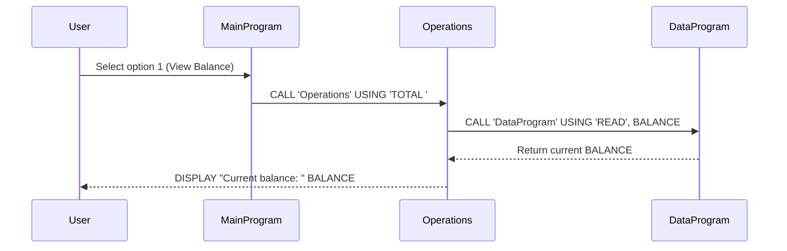
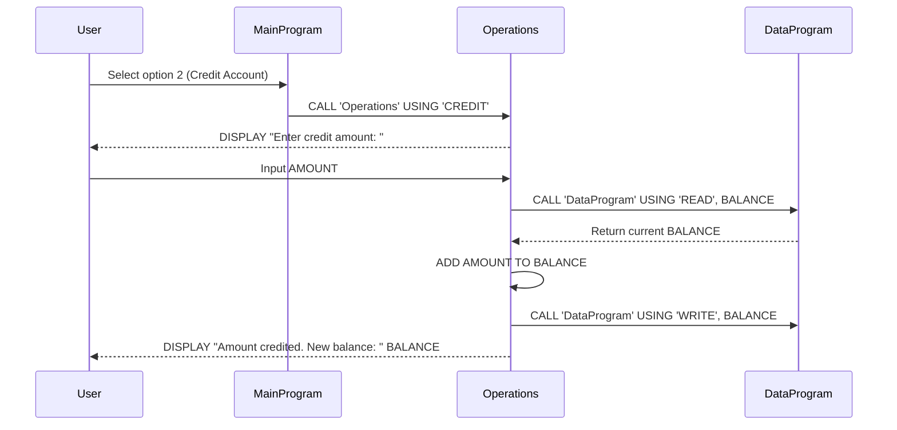
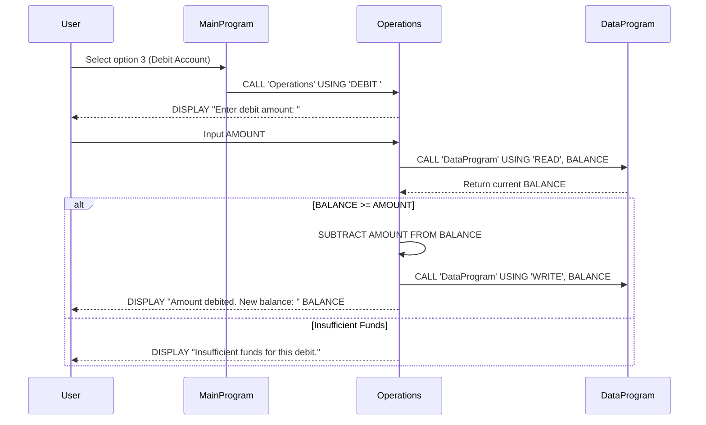

# COBOL Student Account Management System

This project contains a legacy COBOL-based system for managing student accounts. The system allows students to view their account balance, credit funds to their account, and debit funds from their account.

## COBOL Files Overview

### data.cob
**Purpose:** This program serves as the data storage layer for the student account system, managing the persistent storage of account balances.

**Key Functions:**
- `READ` operation: Retrieves the current account balance from storage
- `WRITE` operation: Updates the account balance in storage
- Maintains a working storage balance initialized to $1000.00

**Business Rules:**
- Balance is stored as a 6-digit number with 2 decimal places (PIC 9(6)V99)
- Initial balance is set to $1000.00 for new accounts

### main.cob
**Purpose:** This is the main entry point and user interface for the student account management system, providing a menu-driven interface for account operations.

**Key Functions:**
- Displays a menu with options for account management
- Handles user input for selecting operations
- Calls the Operations program for executing account transactions
- Manages program flow and exit conditions

**Business Rules:**
- Provides four main operations: View Balance (1), Credit Account (2), Debit Account (3), Exit (4)
- Validates user input and handles invalid choices
- Continues operation until user chooses to exit

### operations.cob
**Purpose:** This program handles the core business logic for account operations, including balance inquiries, credits, and debits.

**Key Functions:**
- `TOTAL` operation: Displays the current account balance
- `CREDIT` operation: Adds funds to the account
- `DEBIT` operation: Subtracts funds from the account (with validation)
- Interfaces with the data storage layer for balance management

**Business Rules:**
- **Insufficient Funds Check:** Debit operations are only allowed if the account has sufficient balance
  - If debit amount exceeds current balance, the transaction is rejected with "Insufficient funds for this debit."
- Amount inputs are accepted as 6-digit numbers with 2 decimal places
- All balance updates are persisted through the data storage layer
- Credit operations have no upper limit restrictions

## Sequence Diagram

The following sequence diagram illustrates the data flow for a typical account operation (viewing balance):

For credit operations:

For debit operations (with validation):

